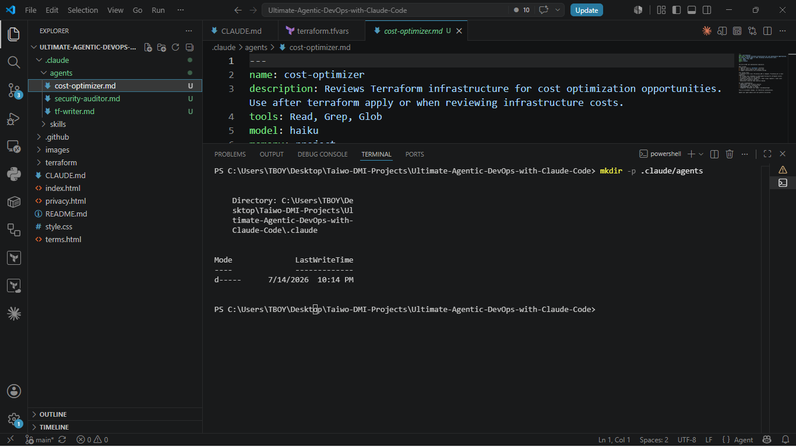
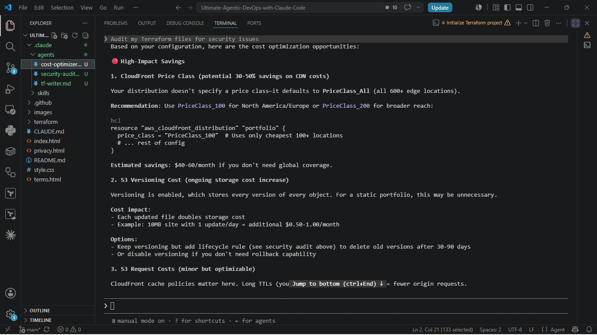
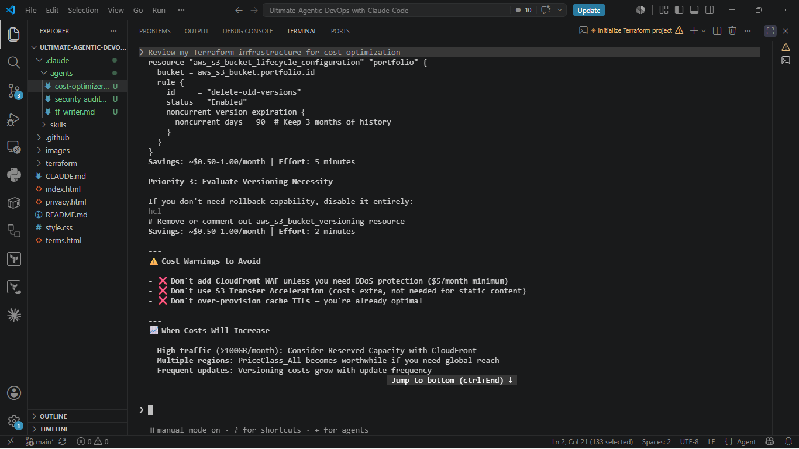
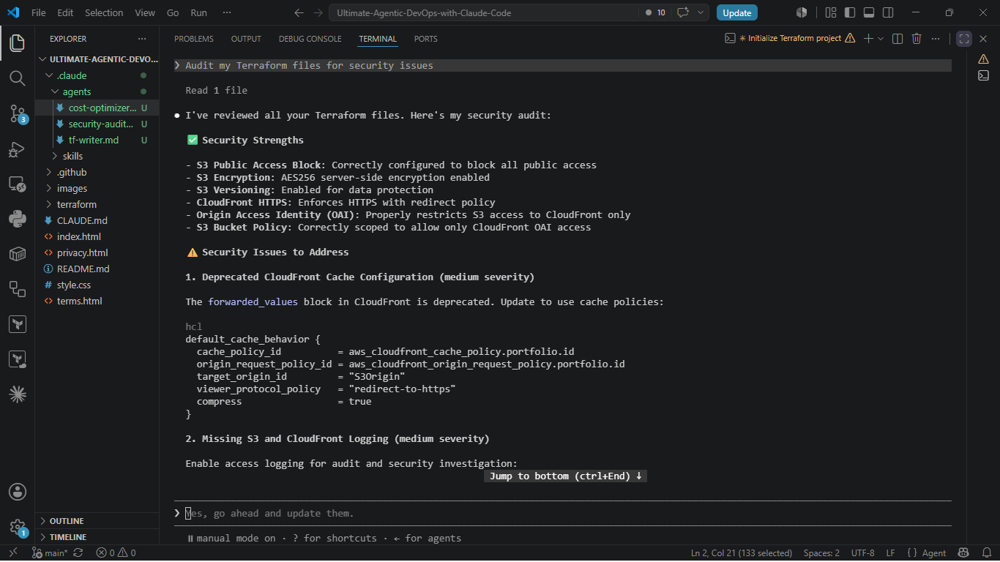
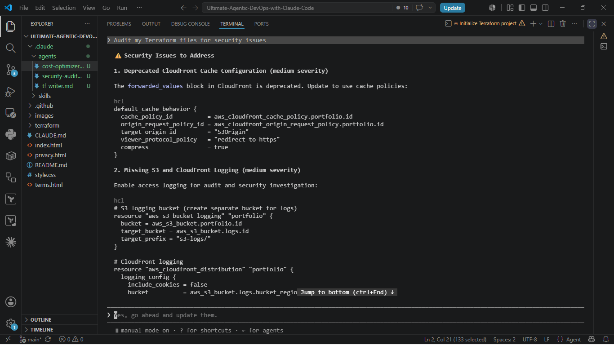
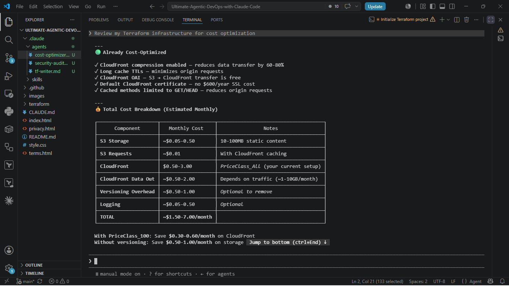
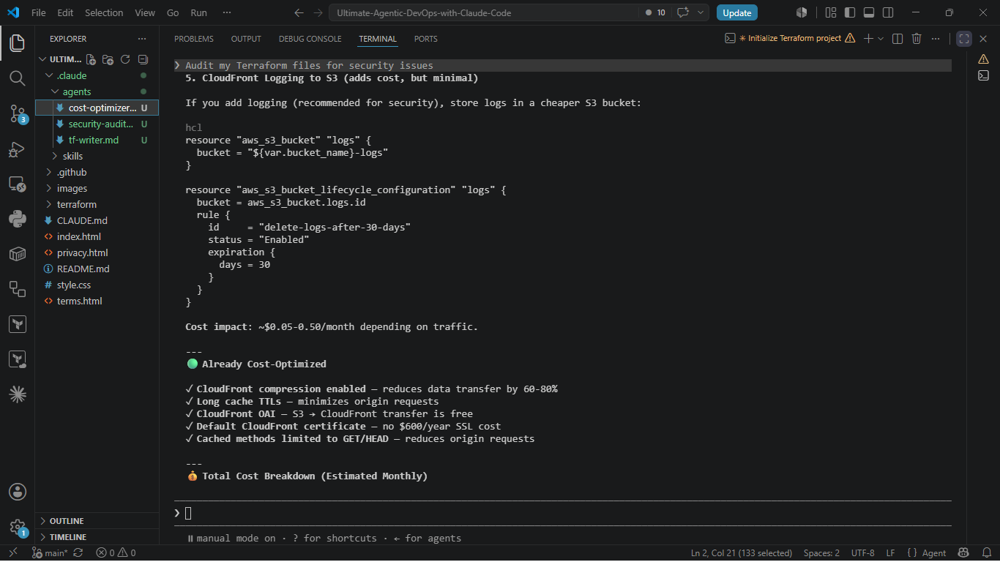
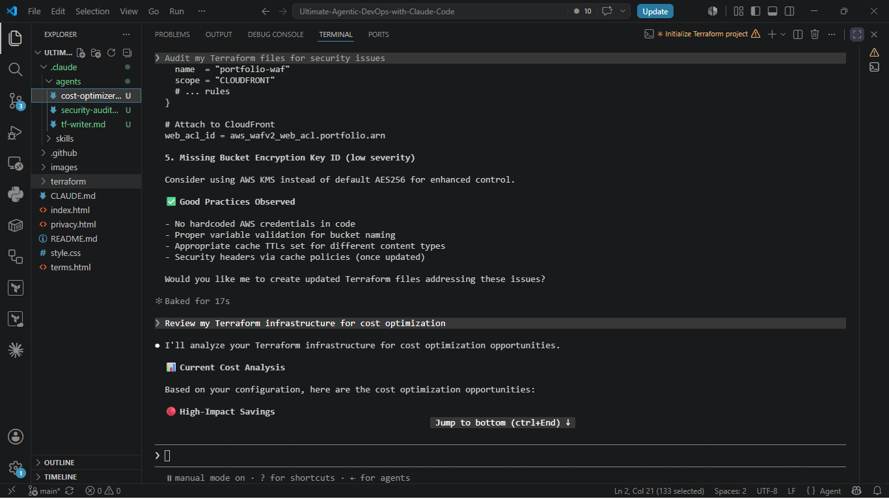
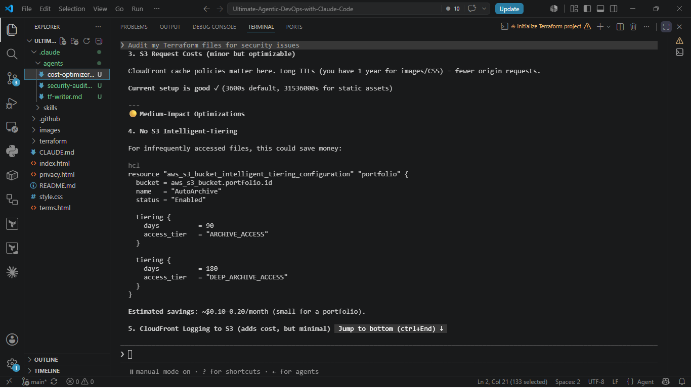

# Assignment 4 — Building Your AI Team

Part of the DevOps Micro Internship (DMI) Cohort 3 with Agentic AI

---

## Purpose

In this assignment, you will build and configure a set of specialized AI subagents inside your project. You will learn how different models and tool permissions define agent behavior, and you will trigger two real agent delegations to analyze security and cost aspects of your Terraform infrastructure.

---

# Task 1 — Create the Agents Folder and Add Files

## Goal

Create the `.claude/agents/` directory and add all required agent files.

### Evidence

#### Screenshot 1 — VS Code sidebar showing `.claude/agents/` with all 3 files

Add your screenshot here.

---

# Task 2 — Compare the Agent Configurations

## Goal

Analyze the configuration differences between the three agents and demonstrate understanding of model and tool selection.

### Written Answers

#### 1. Why does the cost optimizer use Haiku instead of Sonnet?

Add your answer here...

The Cost Optimizer uses Haiku because its tasks are generally:
Parsing Terraform configurations
Identifying cost-saving opportunities
Comparing resource configurations
Producing concise recommendations
These tasks are mostly pattern matching and rule-based analysis, which do not require the deeper reasoning capabilities of Sonnet.
Using Haiku provides several benefits:
Lower cost per request
Faster responses
Sufficient intelligence for straightforward optimization tasks
If every agent used Sonnet, operating costs would increase without significantly improving the quality of cost optimization recommendations.

---

#### 2. Why does the security auditor NOT have Write in its tools list?

Add your answer here...

 The Security Auditor is intended to analyze, inspect, and report security issues—not modify infrastructure.

Removing the Write tool follows the principle of least privilege, meaning an agent should only receive the permissions it actually needs.

Without the Write tool, the security auditor can:

Read Terraform files
Identify vulnerabilities
Produce recommendations

But it cannot:

Modify Terraform code
Accidentally introduce changes
Overwrite infrastructure configurations

This makes the agent safer and reduces the risk of unintended or unauthorized changes.
---

#### 3. Why does the tf-writer use `inherit` instead of a specific model?

Add your answer here...

---  
The tf-writer is responsible for generating or modifying Terraform code, so it benefits from using whichever model is configured as the system's default.

Using:

model: inherit

instead of specifying a model (such as Sonnet or Haiku) provides several advantages:

Automatically uses the project's configured default model.
Makes the configuration easier to maintain because changing the default model updates all inheriting agents.
Allows users or administrators to upgrade models without editing every agent configuration.
Keeps the agent portable across environments with different default model preferences.

---

### Evidence

#### Screenshot 2 — `security-auditor.md` frontmatter showing model and tools configuration

Add your screenshot here.

---

#### Screenshot 3 — `cost-optimizer.md` frontmatter showing the model and tools configuration

Add your screenshot here.
 

---

# Task 3 — Run the Security Auditor

## Goal

Trigger the security auditor agent and analyze the generated security report for your Terraform infrastructure.

### Evidence

#### Screenshot 4 — The delegation message showing Claude launched the security-auditor

Add your screenshot here.

---

#### Screenshot 5 — Security audit report output

Add your screenshot here.

---

# Task 4 — Run the Cost Optimizer

## Goal

Trigger the cost optimizer agent and review the generated cost optimization report.

### Evidence

#### Screenshot 6 — The full cost optimization report

Add your screenshot here.

  
  
 
 
---

# Submission Instructions

- Ensure all agent files are committed in `.claude/agents/`
- Complete all written answers in your GitHub Repo
- Push final changes to your forked GitHub repository

---

## GitHub Repository URL

Paste your forked repository URL here:

`https://github.com/Taiwo-Peter2023/Ultimate-Agentic-DevOps-with-Claude-Code.git`

`https://github.com/Taiwo-Peter2023/devops-micro-internship-pravinmishra.git`

---

# Completion Checklist

- [ ] `.claude/agents/` folder contains all 3 agent files
- [ ] Screenshot 2 shows correct `security-auditor.md` configuration
- [ ] Screenshot 3 shows correct `cost-optimizer.md` configuration
- [ ] All 3 written answers completed 
- [ ] Security auditor executed successfully
- [ ] Cost optimizer executed successfully
- [ ] Security report is visible with findings
- [ ] Cost report is visible with recommendations
- [ ] All required screenshots added
- [ ] GitHub repo updated with agents

---

## 📌 About DMI & CloudAdvisory

DevOps Micro Internship (DMI) is a project-based DevOps program run by Pravin Mishra (The CloudAdvisory) focused on real-world execution, systems thinking, and career readiness.

It helps learners build strong DevOps foundations with hands-on experience.

---

## 📌 Resources

- 🌐 DMI Official Website: https://dmi.pravinmishra.com?utm_source=github&utm_medium=readme  
- 🎓 University: https://university.pravinmishra.com?utm_source=github&utm_medium=readme  
- 💬 Discord Community: https://discord.pravinmishra.com?utm_source=github&utm_medium=readme  
- 📝 Blog: https://dmi.pravinmishra.com/blog?utm_source=github&utm_medium=readme  
- ▶️ YouTube Playlist: https://www.youtube.com/playlist?list=PLFeSNDtI4Cho  
- 🔗 Pravin Mishra (LinkedIn): https://www.linkedin.com/in/pravin-mishra-aws-trainer/  
- 🏢 CloudAdvisory (LinkedIn): https://www.linkedin.com/company/thecloudadvisory/

---

*This submission is part of DevOps Micro Internship (DMI) Cohort 3 — Agentic AI Track.*